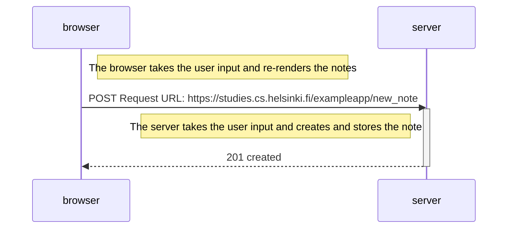

```mermaid
sequenceDiagram
    participant browser
    participant server

    Note right of browser: The browser takes the user input and re-renders the notes

    browser->>server: POST Request URL: https://studies.cs.helsinki.fi/exampleapp/new_note
    activate server
    Note left of server: The server takes the user input and creates and stores the note
    server-->>browser: 201 created
    deactivate server

```
